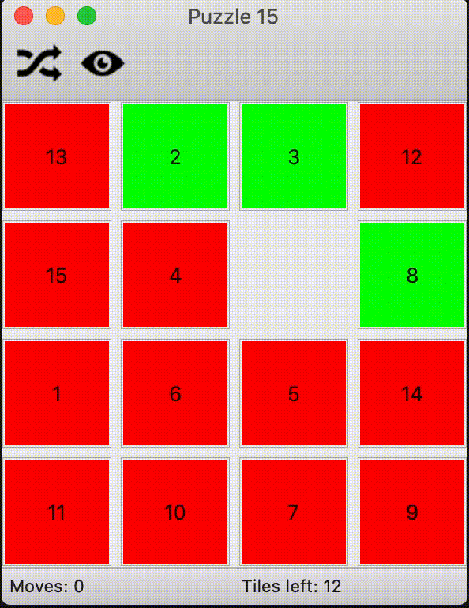
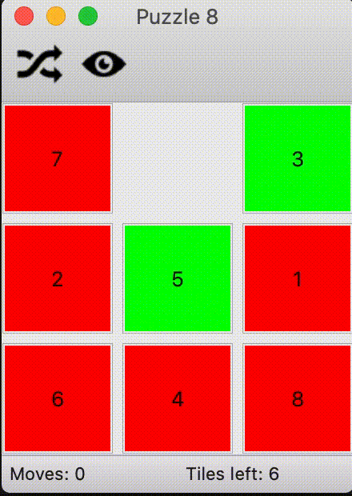

# puzzle15
A Python module that allows to solve the [15-puzzle](http://en.wikipedia.org/wiki/15_puzzle).


## How to Play
The 15-puzzle is a sliding puzzle that consists of a frame of numbered square tiles in random order with one tile missing. The puzzle also exists in other sizes, particularly the smaller 8-puzzle.
The object of the puzzle is to place the tiles in order by making sliding moves that use the empty space.




## Requirements
In order to play the 15-puzzle you have to download and install [Python (2.X version)](https://www.python.org/downloads/) and the [wxPython](http://www.wxpython.org/download.php) GUI library.


## Launch the game
Once you have correctly installed wxPython you can simply run the script by typing (on Unix-based systems):
```bash
./wxPuzzle15.py
```
You can also play with other types of board by adding the board's size as command argument:
```bash
./wxPuzzle15.py 8
```


The only valid configurations are: 15, 8 and 3.


## Use the puzzle15 module
If you just want to use the `puzzle15` module, that allows you to solve the puzzle, you have to
```python
import puzzle15
```
and use its functions, for example:
```python
# get a random configuration of a solvable 15-puzzle (a 4x4 grid)
# a valid configuration is a list of integers between 1 and the total
# number of tiles (16 for the 15-puzzle, the "empty cell" is included)
puzzle = puzzle15.spuzzle(size=4)
# find an optimal solution
# that is, the sequence of moves made to solve the puzzle
steps = puzzle15.solve(puzzle)
```
Other valid configurations are the 8-puzzle (3x3 grid) and the 3-puzzle (2x2 grid). Moreover, you can specify a lower bound which, if reached, stops the search; or you can set a function that will be called every time a new solution is found:
```python
# find the first solution with a number of moves less or equal to the lower bound
steps = puzzle15.solve(puzzle, lowerBound=80)

from __future__ import print_function   # python 2.X
display = lambda s: print(s)
# solve the puzzle and call "display" every time new solution is found
steps = puzzle15.solve(puzzle, solutionFound=display)
```
If the lower bound specified is equal to -1 the function `solve` returns the first solution found. Actually the first solution is computed by using heuristic; you can also use these specific functions in order to obtain faster a solution:
```python
# create a solvable 15-puzzle and solve it by using heuristic
puzzle = puzzle15.spuzzle(size=4)
steps = puzzle15.solve15_heuristic(puzzle)
```
8-puzzle and 3-puzzle versions are available too.

You can solve custom puzzles by checking first if the puzzle is [solvable](http://www.cs.bham.ac.uk/~mdr/teaching/modules04/java2/TilesSolvability.html):
```python
# create a custom 8-puzzle
puzzle = [7, 5, 9, 8, 1, 2, 3, 6, 4]
# solve the puzzle only if it is solvable
if puzzle15.is_solvable(puzzle):
  steps = puzzle15.solve(puzzle)
```

The algorithm used to find an optimal solution is "quite" simple:

1. Find a first solution using [heuristic](http://en.wikipedia.org/wiki/Heuristic_(computer_science))
2. Store the best solution every time a new solution is found.
3. Iterate over all possible configuration stored in a priority queue (sorted by the current configuration "distance" from the solved configuration of the puzzle), by adding new configurations only if it is possible to reach a better solution from these.
